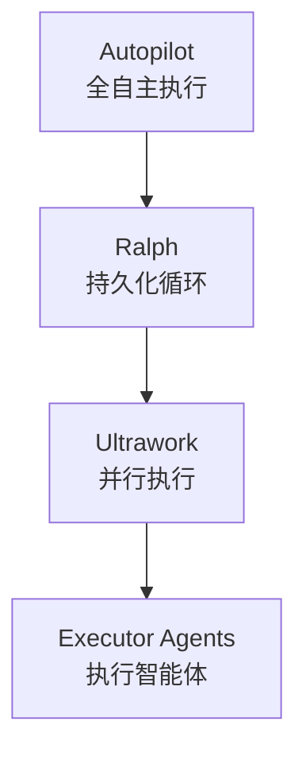
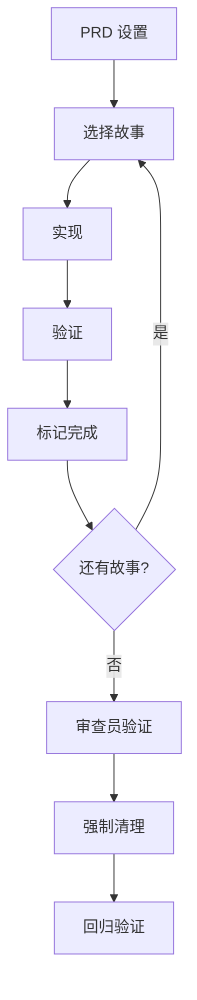

# oh-my-claudecode 完全指南

## 一、oh-my-claudecode 介绍

::: tip 什么是 oh-my-claudecode
oh-my-claudecode（简称 OMC）是一个 Claude Code 插件系统，它引入了"技能"(Skill)的概念，将松散的对话转变为结构化的工作流。不同于普通的单次对话，OMC 提供了完整的软件工程生命周期管理。
:::

<!-- more -->

::: info 核心理念：你是指挥家，不是表演者
> **"You are the conductor, not the performer."**

**黄金法则**：永远不要直接修改代码，始终委派给专业智能体。你的角色是指导、审查和编排。

- **Architect（架构师）** - 把握大局
- **Executor（执行者）** - 编写代码
- **Verifier（验证者）** - 证明它有效
:::

::: info 核心能力
- **Plan** - 不只是给你一个想法，而是生成完整的技术规格和验收标准
- **Ralph** - 不只是"试试看"，而是保证完成，循环执行直到通过验证
- **Autopilot** - 不只是回答你的问题，而是从想法到可运行代码的完整生命周期
:::

### 魔法关键词（Magic Keywords）

OMC 的精髓在于**自然语言触发**——你不需要记忆复杂的命令，只需在对话中包含特定关键词：

| 关键词 | 效果 | 示例 |
|--------|------|------|
| `autopilot` | 全自主执行 | `"autopilot 构建一个 React 仪表盘"` |
| `ralph` | 持久化模式（直到完成） | `"ralph 重构 API"` |
| `ulw` / `ultrawork` | 最大并行度 | `"ulw 修复所有 TypeScript 错误"` |
| `ralplan` | 迭代规划共识 | `"ralplan 这个功能"` |
| `deep-interview` | 苏格拉底式需求澄清 | `"deep-interview 一个模糊想法"` |
| `team` | 多智能体协作 | `"team 5:executor 重构后端"` |
| `stopomc` / `cancelomc` | 停止编排 | `"stopomc"` |

### 与传统 Claude Code 的区别

| 特性 | 普通 Claude Code | oh-my-claudecode |
|------|------------------|------------------|
| 对话方式 | 一次性问答 | 结构化工作流 |
| 状态管理 | 无 | 完整的会话状态 |
| 质量保证 | 依赖用户审查 | 自动验证循环 |
| 任务完成 | 单次尝试 | 持久化直到完成 |
| 并行执行 | 手动管理 | 自动并行调度 |

### 技能层级关系



---

## 二、安装与配置

### 1、安装步骤

```shell
# 通过 Claude Code 插件市场安装
/plugin marketplace add https://github.com/Yeachan-Heo/oh-my-claudecode
/plugin install oh-my-claudecode
```

### 2、初始化配置

```shell
# 项目级配置
/omc-setup --local

# 全局配置
/omc-setup
```

### 3、推荐配置

创建 `~/.claude/settings.json`：

```json
{
  "omc": {
    "autopilot": {
      "maxQaCycles": 5,
      "pauseAfterPlanning": false
    },
    "deepInterview": {
      "ambiguityThreshold": 0.2,
      "maxRounds": 20
    },
    "ralph": {
      "defaultCritic": "architect"
    }
  },
  "omcHud": {
    "preset": "focused",
    "safeMode": true
  }
}
```

### 4、OMC CLI 工具（可选）

如果你安装了 `oh-my-claude-sisyphus` npm 包，可以使用以下命令：

```shell
# 安装
npm install -g oh-my-claude-sisyphus

# 常用命令
omc launch          # 在 tmux 中启动 Claude Code
omc setup           # 安装/同步 OMC 组件
omc config          # 显示/验证配置
omc info            # 列出智能体、技能、MCP 工具
omc doctor          # 运行诊断检查
omc update          # 检查更新
omc wait            # 速率限制管理
omc hud             # 实时 HUD 渲染
```

---

## 三、核心技能详解

### 1、ralplan - 迭代规划共识

::: tip 使用场景
新项目启动前的技术规划、复杂功能的架构设计、需要多方共识的决策场景。
:::

**触发词**：`ralplan`、`plan`

::: warning 注意
旧版关键词 `plan this` / `plan the` 已移除，请使用 `ralplan` 或 `/oh-my-claudecode:omc-plan`
:::

#### 四种模式

| 模式 | 触发条件 | 行为 |
|------|----------|------|
| **Interview** | 默认（宽泛请求） | 交互式需求收集 |
| **Direct** | `--direct` 或详细请求 | 跳过访谈直接生成计划 |
| **Consensus** | `--consensus` | Planner → Architect → Critic 循环 |
| **Review** | `--review` | 审查现有计划 |

#### 使用示例

```shell
# 基础用法
ralplan "创建一个支持 Markdown 的个人博客系统"

# 共识模式（适合重要决策）
ralplan --consensus "设计一个高并发的支付系统"

# 深思熟虑模式（高风险场景）
ralplan --deliberate "数据库迁移方案"

# 直接模式（已有明确需求）
/omc-plan --direct "实现 JWT 认证，使用 Redis 存储 Token"
```

#### 输出内容

Plan 的输出是一个完整的实施计划，包含：

1. **需求摘要** - 核心功能和非功能需求
2. **验收标准** - 可测试的具体指标（90%+ 标准需可测试）
3. **实施步骤** - 带文件引用的详细步骤
4. **风险与缓解** - 潜在风险及应对策略
5. **验证步骤** - 如何确认计划成功
6. **ADR 文档** - 架构决策记录（共识模式）

::: important 质量标准
- 80%+ 的声明需引用文件/行号
- 90%+ 的验收标准需可测试
- 模糊术语需量化（如"快速"→"p99 < 200ms"）
:::

---

### 2、Deep Interview - 苏格拉底式需求澄清

::: tip 使用场景
需求模糊、需要深入理解用户意图、避免"这不是我想要的"结果时。
:::

**触发词**：`deep interview`、`interview me`、`don't assume`

#### 核心机制

Deep Interview 实现**数学模糊度门控**的苏格拉底式提问：

1. **一次只问一个问题** - 绝不批量提问
2. **靶向最弱维度** - 每次针对最不清晰的部分提问
3. **实时模糊度评分** - 每次回答后计算模糊度
4. **阈值控制** - 模糊度 ≤ 20% 才继续

#### 模糊度评分

```
ambiguity = 1 - weighted_sum_of_dimension_scores
```

**维度权重**（Greenfield 项目）：

| 维度 | 权重 |
|------|------|
| 目标清晰度 | 40% |
| 约束清晰度 | 30% |
| 成功标准 | 30% |

#### 实战示例

```shell
/deep-interview "我想做一个电商网站"
```

输出示例：
```
[第 1/20 轮] 模糊度: 85%
问题：你提到的"电商"主要销售什么类型的商品？
      (实体商品/数字产品/服务/混合)

[第 12 轮] 模糊度: 18% ✓
已满足阈值，生成规格文档...
```

---

### 3、Ralph - 保证完成的执行引擎

::: tip 使用场景
任务需要保证完成、需要追踪进度、需要验证审查的场景。
:::

**触发词**：`ralph`、`don't stop`、`must complete`、`finish this`

::: important Ralph 已包含 Ultrawork
Ralph **自动包含** Ultrawork 的并行执行能力，不需要额外组合使用。
:::

#### PRD 驱动的工作方式

Ralph 是**PRD 驱动**的持久化循环，确保：

1. **结构化** - 工作被分解为用户故事
2. **可追踪** - 每个故事有明确的验收标准
3. **可验证** - 需要审查员验证才能标记完成
4. **防烂尾** - 循环执行直到所有故事通过

#### prd.json 结构示例

```json
{
  "stories": [
    {
      "id": "US-001",
      "title": "用户登录",
      "criteria": [
        "用户可以使用邮箱和密码登录",
        "密码错误时返回 401",
        "登录成功后返回 JWT Token"
      ],
      "passes": false
    }
  ]
}
```

#### 9 步工作流程



#### 使用示例

```shell
# 基础用法
ralph "实现用户认证模块"

# 使用 Codex 作为审查员
ralph --critic=codex "重构数据库层"

# 跳过 PRD 生成（简单任务）
ralph --no-prd "修复边界情况 bug"
```

---

### 4、Ultrawork - 并行任务执行

::: tip 使用场景
多个独立任务可同时运行、需要并行处理的批量任务。
:::

**触发词**：`ultrawork`、`ulw`

#### 设计哲学

Ultrawork 是一个**并行执行引擎**，提供：

- ✅ 并行执行能力
- ✅ 智能模型路由
- ❌ 无持久化
- ❌ 无验证循环

通常被 Ralph 或 Autopilot 包含使用。

#### 智能体层级

| 层级 | 模型 | 用途 |
|------|------|------|
| LOW | Haiku | 简单查找/定义 |
| MEDIUM | Sonnet | 标准实现 |
| HIGH | Opus | 复杂分析/重构 |

#### 执行策略

```
并行原则：同时触发所有独立任务
依赖原则：依赖任务顺序执行
后台原则：>30秒的操作放入后台
```

---

### 5、Autopilot - 一站式全自动

::: tip 使用场景
端到端交付、从想法到可运行代码的完整生命周期。
:::

**触发词**：`autopilot`、`auto pilot`、`build me`、`create me`、`make me`、`full auto`、`handle it all`、`I want a/an...`

#### 完整生命周期

| 阶段 | 名称 | 描述 | 输出 |
|------|------|------|------|
| 0 | 扩展 | 将想法扩展为详细规格 | `spec.md` |
| 1 | 规划 | 创建实施计划 | `plan.md` |
| 2 | 执行 | 并行实施 | 工作代码 |
| 3 | QA | 循环测试修复 | 验证代码 |
| 4 | 验证 | 多视角审查 | 审批代码 |
| 5 | 清理 | 清理状态 | 干净退出 |

#### 停止条件

- **正常完成**：所有阶段完成
- **QA 失败**：同一错误出现 3 次（根本性阻塞）
- **验证失败**：3 轮重验证后仍失败
- **用户取消**：`cancel`、`stop`、`abort`、`stopomc`

#### 使用示例

```shell
# 自然语言触发
autopilot build a React dashboard with user authentication

# 完整项目
/autopilot "创建一个待办事项应用，支持添加、完成、
删除任务，数据存储在 localStorage"

# 复杂功能
/autopilot "实现一个支持 OAuth2 的认证系统，
使用 JWT，Token 存储在 Redis"
```

---

## 四、实用技能速查

### UltraQA - 自动化 QA 循环

**用途**：测试、验证、修复，循环直到目标达成

```shell
/ultraqa --tests      # 所有测试通过
/ultraqa --build      # 构建成功
/ultraqa --lint       # 无 lint 错误
/ultraqa --typecheck  # TypeScript 无错误
```

**工作流程**：运行 QA → 检查 → 架构诊断 → 修复 → 重复（最多 5 轮）

---

### Trace / Deep Dive - 问题调查

**Trace**：证据驱动的因果调查
```shell
/trace "用户报告订单偶尔重复创建"
```

**Deep Dive**：Trace + Deep Interview 的组合
```shell
/deep-dive "问题描述"
  → 3 条 Trace 路径并行调查
  → Deep Interview 整合结果
  → 输出完整规格
```

---

### Team - 多智能体协作

**用途**：生成 N 个协调智能体共同完成任务

```shell
/team 5:executor "重构认证模块"
/team ralph "实现支付功能"
```

**管道**：`team-plan → team-prd → team-exec → team-verify → team-fix`

---

### AI Slop Cleaner - 代码清理

**用途**：清理 AI 生成的代码杂乱

```shell
/ai-slop-cleaner src/modules/auth.ts
/ai-slop-cleaner src/ --review  # 仅审查模式
```

**杂乱类型**：重复逻辑、死代码、过度抽象、边界违规

---

### 其他实用技能

| 技能 | 用途 | 命令 |
|------|------|------|
| `ask` | 询问 Claude/Codex/Gemini CLI | `/ask codex "review this"` |
| `cancel` / `stopomc` | 智能取消活跃模式 | `/cancel` 或 `stopomc` |
| `hud` | 配置状态显示 | `/hud focused` |
| `skill` | 管理本地技能 | `/skill list` |
| `ccg` | Claude-Codex-Gemini 合成 | `/ccg review this PR` |
| `deepsearch` | 代码库聚焦搜索 | `deepsearch for auth middleware` |
| `ultrathink` | 深度推理模式 | `ultrathink about this architecture` |
| `tdd` | TDD 工作流强制执行 | `tdd: implement password validation` |
| `eco` / `ecomode` | 节省 Token 模式 | `eco refactor this module` |

---

## 五、实战工作流组合

### 1、新项目启动流程

**流程**：`Deep Interview → ralplan (Consensus) → Autopilot`

```shell
# 1. 需求澄清
/deep-interview "我想做一个在线课程平台"

# 2. 共识规划
ralplan --consensus --direct

# 3. 自动执行
autopilot
```

---

### 2、Bug 修复流程

**流程**：`Trace → Ralph`

```shell
# 1. 根因调查
trace "用户报告订单偶尔重复创建"

# 2. 修复实现
ralph "修复订单重复创建问题"
```

---

### 3、代码重构流程

**流程**：`ralplan → Ultrawork → UltraQA`

```shell
# 1. 重构规划
ralplan "将回调风格重构为 async/await"

# 2. 并行重构
ulw

# 3. 质量验证
ultraqa --tests
```

---

### 4、功能迭代流程

**流程**：`ralplan → Ralph (with PRD)`

```shell
# 1. 功能规划
ralplan "添加评论功能，支持嵌套回复"

# 2. 迭代实现
ralph
```

---

## 六、进阶技巧与最佳实践

### 1、技能选择决策树

```
需求是否明确？
├─ 否 → Deep Interview
└─ 是 → 任务复杂度？
    ├─ 简单 → Ralph / Ultrawork
    └─ 复杂 → 是否需要规划？
        ├─ 是 → ralplan → (Ralph/Autopilot)
        └─ 否 → Autopilot
```

### 2、Prompt 编写技巧

**好的 Prompt 结构**：`[领域] + [核心功能] + [约束条件] + [质量标准]`

::: tip 示例
"创建一个【个人财务管理应用】(领域)，
支持记账、分类统计、月度报表(核心功能)，
使用 React + TypeScript + IndexedDB(约束条件)，
要求响应式、支持 PWA、离线可用(质量标准)"
:::

### 3、成本与效率平衡

| 场景 | 推荐技能 | 成本 | 可靠性 |
|------|----------|------|--------|
| 快速原型 | Autopilot | 高 | 高 |
| 生产功能 | Plan + Ralph | 中 | 很高 |
| 探索性任务 | Deep Interview | 中 | 中 |
| 简单修复 | Ralph --no-prd | 低 | 高 |
| 批量重构 | Ultrawork | 低 | 中 |

### 4、常见陷阱与规避

| 陷阱 | 规避方法 |
|------|----------|
| 任务范围蔓延 | 使用 Plan 明确边界 |
| AI 生成低质量代码 | Ralph 的强制审查机制 |
| 需求理解偏差 | Deep Interview 澄清 |
| 并行任务冲突 | Ultrawork 的依赖分析 |
| 状态混乱 | 定期使用 `/cancel` 清理 |

---

## 七、技能速查表

### 核心技能

| 技能 | 关键词 | 输出 | 场景 |
|------|--------|------|------|
| ralplan | `ralplan` | `.md` 计划 | 项目规划 |
| Deep Interview | `deep-interview` | `.md` 规格 | 需求澄清 |
| Ralph | `ralph` | 完成代码 | 保证执行 |
| Ultrawork | `ulw` / `ultrawork` | 并行结果 | 批量任务 |
| Autopilot | `autopilot` / `build me` | 完整项目 | 端到端交付 |
| UltraQA | `ultraqa` | 验证结果 | 质量保证 |
| Trace | `trace` | 调查报告 | 问题诊断 |
| Deep Dive | `deep-dive` | 完整规格 | 调查+需求 |
| Team | `team` | 协作结果 | 大规模任务 |

### 辅助技能

| 技能 | 关键词 | 用途 |
|------|--------|------|
| AI Slop Cleaner | `deslop` / `anti-slop` | 代码清理 |
| CCG | `ccg` | Claude-Codex-Gemini 合成 |
| Deep Search | `deepsearch` | 代码库聚焦搜索 |
| Ultra Think | `ultrathink` | 深度推理模式 |
| TDD | `tdd` | TDD 工作流强制执行 |
| Eco Mode | `eco` / `ecomode` | 节省 Token 模式 |
| Cancel | `stopomc` / `cancelomc` | 停止编排 |

---

## 八、总结

### oh-my-claudecode 带来的改变

oh-my-claudecode 将 Claude Code 从**单次对话工具**转变为**完整的软件工程助手**：

- **结构化**：从随意对话到规范流程
- **可追踪**：从黑盒到状态可见
- **可保证**：从"试试看"到"保证完成"
- **可组合**：从单技能到工作流管道

### 核心原则

1. **分层执行**：根据任务复杂度选择合适层级
2. **状态管理**：善用状态文件追踪进度
3. **质量保证**：审查和验证不可或缺
4. **人机协作**：AI 执行，人类决策

---

::: info 参考链接
- [oh-my-claudecode GitHub](https://github.com/Yeachan-Heo/oh-my-claudecode)
- [官方文档](https://yeachan-heo.github.io/oh-my-claudecode-website/docs.html)
- [Skills Marketplace](https://playbooks.com/skills/yeachan-heo/oh-my-claudecode)
- [Claude Code 使用指南](./ClaudeCode.md)
- [Superpowers 编程 skills 介绍](./superpowers.md)
:::
