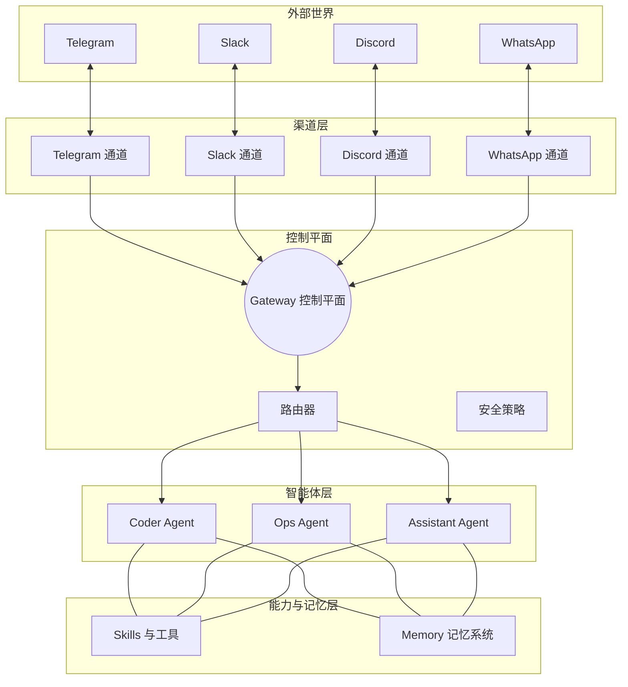

# OpenClaw 完整配置指南：架构设计、多 Agent 管理与安全防护

<div style="display: flex; align-items: center; margin-bottom: 20px;">
  
  <strong>OpenClaw</strong> 作为一个新兴的多智能体 (Multi-Agent) 框架和平台，正在重新定义 AI Agent 的本地化部署与分布式协同体验。
</div>
<!-- more -->

> 这是一篇偏「架构与工程实践」的 OpenClaw 配置指南：从整体架构到多 Agent 管理，再到安全与审计配置，帮助你搭出一套既好用又安全的个人/团队 AI 助手系统。

---

## 一、OpenClaw 概述与设计哲学

### 1.1 项目背景

2026 年，各类 AI Agent 项目爆发，**OpenClaw**（前身 ClawdBot / Moltbot）很快成长为开源个人 AI 助手领域的代表项目之一（GitHub Star 已突破 17 万）。

它由 PSPDFKit 创始人 Peter Steinberger 发起，核心特点是：完全开源、高度可定制、专注本地与私有化使用场景。

OpenClaw 的设计坚持几条原则：

1. **声明式优于命令式**：尽量用配置文件描述系统行为，而不是到处写脚本。
2. **分层与模块化**：Gateway / Agent / Channel / Skill / Memory 分层清晰，方便替换和扩展。
3. **用户可控**：关键行为都有配置入口；默认安全，但不强行锁死。
4. **安全优先**：从网络到执行环境都有防线，而不是上线前再补安全补丁。
5. **开放扩展**：通过 Skills、工具和 Provider 机制扩展能力。

### 1.2 核心架构组件

从架构视角看，OpenClaw 可以拆成几块核心组件：

- **Gateway（网关）**：控制平面，统一管理连接和消息路由，对外提供 WebSocket / HTTP API。
- **Agent（代理）**：一个独立的 AI 实例，拥有自己的 System Prompt、工具集和记忆空间。
- **Channel（通道）**：与外部世界交互的入口，比如 WhatsApp、Telegram、Slack、Discord 等。
- **Skill（技能）**：可扩展功能模块，通过 `SKILL.md` 定义能力边界，可挂载到不同 Agent。
- **Memory（记忆）**：用来做持久化和检索，包括日志、精选记忆、向量检索等。

#### 架构总览图（Mermaid）



### 1.3 配置文件体系总览

OpenClaw 把「行为」拆散到多个配置层次中，大致如下：

| 层级         | 位置                        | 说明                                      |
| ------------ | --------------------------- | ----------------------------------------- |
| 项目级配置   | 仓库根目录                  | `.eslintrc`、`.prettierrc`、`tsconfig.json` 等 |
| Gateway 核心 | `~/.openclaw/openclaw.json` | 运行时核心配置：模型、工具、Agent、安全策略 |
| 工作空间配置 | `~/.openclaw/workspace/`    | Agent 的本地文件系统与注入式配置文件      |
| 环境配置     | `~/.openclaw/.env`          | 存放 API Key/Token 等敏感信息，不进仓库   |
| 注入式配置   | `AGENTS.md`、`SOUL.md` 等   | 会被直接注入 System Prompt，控制 Agent 行为 |

---

## 二、核心配置模块详解

### 2.1 身份配置文件

这些 Markdown 文件共同定义了「谁在说话、为谁服务、该怎么说」。

#### AGENTS.md — 代理行为规范

为 Agent 定义：

- **身份与角色**：例如「资深全栈工程师」「数据分析助手」。
- **行为准则**：如何提问追问、如何分步执行、什么时候要确认。
- **编码规范**：语言、风格、测试要求、日志习惯等。
- **安全边界**：哪些操作永远不能做（删除文件、推代码到远端等）。

#### SOUL.md — 价值观与个性

更偏人格化的一层：

- **核心价值观**：如诚实、透明、谨慎、不编造数据。
- **沟通风格**：正式/口语、简洁/详细、是否主动给建议。
- **决策原则**：遇到模糊需求如何处理，是偏保守还是偏探索。
- **边界意识**：避免过度拟人、避免情绪化表达等。

#### IDENTITY.md — 身份档案

用于描述 Agent 的「人设档案」：

- 基本信息：名称、版本、创建时间。
- 形象描述：头像、外观、多模态描述。
- 声音特征：如接入 TTS 时的声线偏好。
- 签名语与问候语：统一开场与收尾语气。

#### USER.md — 用户画像

告诉 Agent「你是谁、你的偏好是什么」：

- 基本信息：名称、联系方式、时区。
- 技术背景：主要语言、使用框架、熟悉程度。
- 交互偏好：更爱要代码还是解释，更偏向中文还是英文。
- 隐私设置：哪些内容可以长久记录，哪些需要即时忘记。

---

### 2.2 System Prompt 构建机制

OpenClaw 的 System Prompt 不是一坨长文，而是由多个模块拼起来的：

- **Tooling**：可用工具列表与使用规范。
- **Safety**：安全相关条款，包含禁止行为和敏感操作策略。
- **Skills**：挂载的 Skills 列表和调用方式说明。
- **Self-Update / Workspace / Documentation**：如何利用项目文档、自我改进等。
- **Sandbox / Runtime / Date & Time / Reasoning**：当前时间、运行环境、推理风格等信息。

根据不同场景，还可以选择不同 Prompt 模式：

- **full**：主 Agent 使用，信息最全，适合长对话和复杂任务。
- **minimal**：子 Agent 或工具型 Agent 使用，只保留必要指令，节省 token。
- **none**：只保留基础身份，用于测试或极简场景。

---

### 2.3 工具系统配置

在 `openclaw.json` 中的 `tools` 字段集中管理工具权限，例如：

```json
{
  "tools": {
    "allow": ["*"],
    "deny": ["browser"],
    "profile": "coding",
    "byProvider": {
      "google-antigravity": {
        "profile": "minimal"
      }
    }
  }
}
```

几个关键点：

- **Profile 预设**：
  - `minimal`：最小权限。
  - `coding`：包含文件系统、运行时、会话、记忆、图像等常用开发工具。
  - `messaging`：面向聊天与通知。
  - `full`：基本不做限制，仅适合严格受控环境。
- **按组配置**：支持 `group:fs`、`group:runtime`、`group:sessions`、`group:memory`、`group:messaging` 等逻辑分组，简化管理。
- **按 Provider 覆盖**：可以为不同模型提供方指定不同 Profile，例如云模型收紧权限、本地模型放宽权限。

---

### 2.4 技能（Skills）系统配置

技能是一种「带说明书的能力包」，以目录形式存在：

```text
skills/my-skill/
├── SKILL.md      # 必需：技能说明与边界
├── index.js      # 可选：技能入口代码
└── utils/        # 可选：辅助文件
```

`SKILL.md` 通常包含：

- 技能名称与功能概述。
- 适用场景与限制条件。
- 调用方式、参数说明与返回格式。
- 一两个典型使用示例。

OpenClaw 还提供了 **ClawHub 注册中心**，用于分发与管理技能：

```json
{
  "clawhub": {
    "enabled": true,
    "registry": "https://clawhub.openclaw.ai"
  }
}
```

---

### 2.5 记忆系统配置

记忆系统大致分三层：

- **短期记忆**：对话上下文，由 LLM 上下文窗口承担。
- **长期记忆**：
  - 按天日志文件：`memory/YYYY-MM-DD.md`。
  - 精选记忆文件：`MEMORY.md`。
- **向量记忆**：通过向量模型做语义检索。

配置示例：

```json
{
  "memory": {
    "backend": "memory-core",
    "embedding": {
      "provider": "local",
      "model": "all-MiniLM-L6-v2"
    }
  }
}
```

这样既可以用本地嵌入模型，避免敏感数据离开本机，又保留了替换后端的空间。

---

### 2.6 Gateway 配置

Gateway 是系统的中心节点，典型配置如下：

```json
{
  "gateway": {
    "host": "127.0.0.1",
    "port": 18789,
    "canvasHost": { "enabled": true, "port": 18793 },
    "reload": { "mode": "hybrid" }
  }
}
```

其中：

- `host` 建议默认绑定本地回环地址，避免直接暴露到公网。
- `reload.mode` 支持：
  - `hybrid`：尽量热应用配置变更，必要时重启。
  - `off`：禁用热重载。
  - `restart`：有变更就重启，行为更简单但打断更频繁。

---

## 三、多 Agent 架构与管理

### 3.1 多 Agent 设计思想

OpenClaw 使用扁平路由模型，由 Gateway 统一处理消息，然后根据配置把消息路由到不同 Agent：

- 避免 agent 嵌套调用导致的上下文污染和角色混乱。
- 通过配置实现「不同平台 / 不同用途 / 不同安全级别」的 Agent 分工。

在资源层面，多 Agent 之间尽量做隔离：

| 资源       | 是否共享 | 说明                           |
| ---------- | -------- | ------------------------------ |
| 工作空间   | 否       | 各有独立目录                  |
| 记忆文件   | 否       | 独立的 `MEMORY.md` 和日志      |
| 会话历史   | 否       | 对话完全隔离                  |
| 认证凭证   | 否       | 独立 `auth-profiles.json`     |
| 技能配置   | 可选     | 可通过白名单共享              |
| AI 模型    | 可选     | 可按 Agent 指定不同 Provider/模型 |

### 3.2 Agent 配置与角色定义

创建 Agent 通常通过命令行完成，例如：

```bash
openclaw agents add coding
openclaw agents add social
openclaw agents add work
```

然后在 `openclaw.json` 中进行细化配置：

```json
{
  "agents": {
    "defaults": {
      "model": "anthropic:claude-opus-4-6",
      "maxTokens": 8192,
      "temperature": 0.7
    },
    "list": [
      {
        "agentId": "main",
        "workspace": "~/.openclaw/workspace",
        "model": "anthropic:claude-opus-4-6"
      },
      {
        "agentId": "coding",
        "workspace": "~/.openclaw/workspace-coding",
        "temperature": 0.3,
        "skills": {
          "enabled": ["coding-agent", "github", "gh-issues", "tmux"]
        },
        "bindings": [
          {
            "channel": "discord",
            "guildId": "123456789",
            "channelId": "987654321"
          }
        ]
      },
      {
        "agentId": "social",
        "workspace": "~/.openclaw/workspace-social",
        "model": "openai:gpt-5.2-mini",
        "temperature": 0.9,
        "skills": {
          "enabled": ["summarize", "weather", "goplaces"]
        },
        "bindings": [
          {
            "channel": "telegram",
            "chatId": "-100123456789"
          }
        ]
      }
    ]
  }
}
```

每个 Agent 的工作空间里通常都会有独立的 `SOUL.md` 等文件，确保人格和记忆互不干扰。

### 3.3 消息路由与绑定

路由规则通常是：

1. 优先匹配 `bindings` 中明确指定的 Channel / 群组 / 频道。
2. 没有匹配时，私聊默认交给 `main` Agent。
3. 其他情况回退到 `main` 或你设定的默认 Agent。

支持绑定的渠道包括 Discord、Telegram、Slack、WhatsApp 等，具体参数因平台而异，但模式类似。

查看当前 Agent 状态：

```bash
openclaw agents list
```

### 3.4 Agent 间通信机制

OpenClaw 提供了基于 Sessions 的直接通信工具：

- `sessions_list`：列出活跃会话。
- `sessions_history`：查看会话历史。
- `sessions_send`：向其他会话发送消息。
- `sessions_spawn`：创建新会话。

也可以通过更松散的方式协作：

- 共享文件：一个 Agent 写入文件，另一个定期读取处理。
- 用户中转：由人类选择何时把某个对话/结果转交给另一个 Agent。
- 定时任务：通过 Cron 或调度系统把多个 Agent 串成流水线。
- Webhook：由外部系统触发指定 Agent 任务。

### 3.5 任务协作策略

常见的多 Agent 协作方式包括：

1. **按职能分工**：如「写代码」「审查代码」「部署运维」三个 Agent。
2. **按平台分工**：不同 Agent 负责 Telegram、Slack、邮箱等不同入口。
3. **按安全等级分工**：有的 Agent 只能读文件，有的可以改配置。
4. **流水线式协作**：一个 Agent 生成草稿，另一个 Agent 审阅和优化。

### 3.6 实战案例

- **客服 + 技术支持双 Agent**：
  - Community Agent：负责社区闲聊、一般问题，使用轻量模型。
  - Tech Support Agent：处理技术问题，使用更强模型和更多工具。
  - 私聊默认由 main Agent 兜底。

- **内容创作流水线**：
  - Translator Agent：负责翻译与多语言转换。
  - Writer Agent：负责改写与润色。
  - Reviewer Agent：负责事实核查和风格统一。
  - 通过定时任务或共享文件进行串联。

---

## 四、安全配置与防护

### 4.1 安全架构概述

OpenClaw 的安全设计是典型的**纵深防御 + 零信任**，可以概括为五层：

1. **网络边界**：TLS、防火墙、IP 白名单、限流。
2. **认证与授权**：Gateway Token、配对系统、角色权限。
3. **输入验证**：Prompt 护栏、长度限制、非法指令过滤。
4. **执行隔离**：Docker 沙箱、最小权限运行。
5. **审计与监控**：日志与告警。

### 4.2 API Key 安全管理

API Key 绝不要硬编码在代码或仓库里，推荐用系统环境变量或 `.env` 文件：

```bash
# 系统环境变量
echo 'export OPENAI_API_KEY="sk-xxxx"' >> ~/.bashrc
source ~/.bashrc

# 独立 .env 文件
cat > ~/.openclaw/.env << 'EOF'
OPENAI_API_KEY=sk-xxxx
ANTHROPIC_API_KEY=ant-xxxx
EOF

chmod 600 ~/.openclaw/.env
```

建议定期轮换密钥（例如每 90 天一次），一旦怀疑泄露立即更换。

### 4.3 沙箱系统配置

沙箱用于约束高风险操作（命令执行、文件系统访问等），典型配置如下：

```json
{
  "agents": {
    "defaults": {
      "sandbox": {
        "mode": "non-main",
        "toolAllowlist": ["bash", "process", "read", "write", "edit", "sessions_*"],
        "toolDenylist": ["browser", "canvas", "nodes", "cron", "discord", "gateway"],
        "securityOpt": ["no-new-privileges:true"],
        "capDrop": ["ALL"],
        "readOnlyRootfs": true,
        "tmpfsSize": "64m",
        "noSetuid": true
      }
    }
  }
}
```

沙箱模式：

- `non-main`：非主会话一律进沙箱（推荐默认）。
- `always`：所有任务都在沙箱里跑。
- `never`：完全关闭沙箱，仅适合调试。

### 4.4 权限控制

#### Gateway 认证

Gateway 应启用 Token 认证，生成方式示例：

```bash
openssl rand -hex 32
export OPENCLAW_GATEWAY_TOKEN="随机Token"
```

#### DM Pairing 配对系统

为了阻止陌生账户直接与 Agent 通信，可以启用配对模式：

```json
{
  "channels": {
    "dmPolicy": "pairing"
  }
}
```

常用命令：

```bash
openclaw pairing approve <channel> <code>
openclaw pairing list
openclaw pairing revoke <contact>
```

#### 用户权限分级

可以为不同用户分配不同角色，限制可用工具与 Agent：

```json
{
  "permissions": {
    "roles": {
      "admin": {
        "tools": ["*"],
        "agents": ["*"],
        "maxTokensPerDay": -1,
        "canModifyConfig": true
      },
      "user": {
        "tools": ["search", "calendar"],
        "agents": ["assistant", "researcher"],
        "maxTokensPerDay": 100000
      },
      "guest": {
        "tools": ["search", "weather"],
        "agents": ["assistant"],
        "maxTokensPerDay": 10000
      }
    },
    "userRoles": {
      "my-telegram-id": "admin",
      "default": "guest"
    }
  }
}
```

#### 文件访问权限

文件系统访问同样建议默认拒绝，再逐条放开：

```json
{
  "filesystem": {
    "defaultPolicy": "deny",
    "rules": [
      {
        "path": "~/.openclaw/workspace",
        "permissions": ["read", "write", "create", "delete"]
      },
      {
        "path": "~/Documents",
        "permissions": ["read"]
      },
      {
        "path": "~/.openclaw/openclaw.json",
        "permissions": []
      },
      {
        "path": "~/.ssh",
        "permissions": []
      }
    ]
  }
}
```

### 4.5 网络安全

#### TLS 1.3 强制启用

```json
{
  "gateway": {
    "tls": {
      "enabled": true,
      "minVersion": "1.3",
      "certFile": "/path/to/cert.pem",
      "keyFile": "/path/to/key.pem"
    }
  }
}
```

#### 远程访问建议

- 使用 SSH 隧道暴露本地端口。
- 使用 Tailscale / WireGuard 搭建内网访问。
- 避免直接把 Gateway 端口暴露到公网。

#### IP 白名单与限流

```json
{
  "gateway": {
    "security": {
      "ipWhitelist": {
        "enabled": true,
        "allowedIPs": ["127.0.0.1", "192.168.1.0/24"]
      },
      "rateLimiting": {
        "enabled": true,
        "maxRequestsPerMinute": 60,
        "maxRequestsPerHour": 1000,
        "burstSize": 10
      }
    }
  }
}
```

### 4.6 数据隐私保护

#### 静态数据加密

```json
{
  "storage": {
    "encryption": {
      "enabled": true,
      "algorithm": "aes-256-gcm",
      "keyDerivation": "argon2id"
    }
  }
}
```

#### 本地模型方案

通过本地模型 Provider 可以在完全离线的环境下使用 OpenClaw：

```json
{
  "providers": {
    "ollama": {
      "type": "ollama",
      "baseUrl": "http://127.0.0.1:11434",
      "models": ["llama3.1", "qwen2.5"]
    }
  },
  "agents": {
    "defaults": {
      "provider": "ollama",
      "model": "llama3.1"
    }
  }
}
```

### 4.7 日志审计

审计日志用于追踪敏感行为与异常事件，配置示例如下：

```json
{
  "logging": {
    "audit": {
      "enabled": true,
      "level": "info",
      "file": "~/.openclaw/logs/audit.log",
      "maxSize": "100m",
      "maxFiles": 30,
      "compress": true,
      "events": [
        "auth.success",
        "tool.execute",
        "config.change",
        "injection.detected"
      ]
    }
  }
}
```

### 4.8 安全最佳实践清单

**必须做（CRITICAL）**：

- 配置 Gateway 认证（Token）。
- 所有 API Key 使用环境变量或 `.env` 管理。
- 启用 DM 配对机制。
- Gateway 只绑定本地或内网地址。
- 关键配置文件权限设为 600。
- 开启 TLS 1.3。
- 启用沙箱并配置工具白名单。
- 打开 Prompt 护栏相关配置。
- 定期运行 `openclaw doctor` 检查配置。

**强烈建议（HIGH）**：

- 配合防火墙，避免端口直接外暴。
- 通过 SSH 隧道或 VPN 暴露服务。
- 启用审计日志与限流策略。
- 文件访问策略默认 deny，仅对必要路径放行。
- 禁用不用的高风险工具。
- 为 Webhook 配置签名验证。

---

## 五、最终完整配置模板

下面是一个覆盖常见场景的完整 `~/.openclaw/openclaw.json` 模板（部分字段以注释形式省略细节）：

```jsonc
// ~/.openclaw/openclaw.json
{
  "gateway": {
    "host": "127.0.0.1",
    "port": 18789,
    "canvasHost": { "enabled": true, "port": 18793 },
    "reload": { "mode": "hybrid" },
    "auth": { "mode": "token" },
    "tls": {
      "enabled": true,
      "minVersion": "1.3",
      "certFile": "/etc/letsencrypt/live/your-domain.com/fullchain.pem",
      "keyFile": "/etc/letsencrypt/live/your-domain.com/privkey.pem"
    },
    "security": {
      "ipWhitelist": {
        "enabled": true,
        "allowedIPs": ["127.0.0.1", "::1", "192.168.1.0/24"]
      },
      "rateLimiting": {
        "enabled": true,
        "maxRequestsPerMinute": 60,
        "maxRequestsPerHour": 1000,
        "burstSize": 10
      }
    }
  },
  "agents": {
    "defaults": {
      "model": "anthropic:claude-opus-4-6",
      "fallbackModels": ["openai/gpt-4.5", "google/gemini-pro"],
      "maxTokens": 8192,
      "temperature": 0.7,
      "sandbox": {
        /* 同前文沙箱配置 */
      },
      "systemPrompt": {
        "guardrails": true,
        "maxLength": 10000,
        "injection": {
          "detection": true,
          "action": "block",
          "logAttempts": true
        }
      }
    },
    "list": [
      {
        "agentId": "main",
        "workspace": "~/.openclaw/workspace",
        "model": "anthropic:claude-opus-4-6"
      },
      {
        "agentId": "coding",
        "workspace": "~/.openclaw/workspace-coding",
        "temperature": 0.3,
        "skills": {
          "enabled": ["coding-agent", "github", "gh-issues", "tmux"]
        },
        "bindings": [
          {
            "channel": "discord",
            "guildId": "123456789",
            "channelId": "987654321"
          }
        ]
      },
      {
        "agentId": "social",
        "workspace": "~/.openclaw/workspace-social",
        "model": "openai:gpt-5.2-mini",
        "temperature": 0.9,
        "skills": {
          "enabled": ["summarize", "weather", "goplaces"]
        },
        "bindings": [
          {
            "channel": "telegram",
            "chatId": "-100123456789"
          }
        ]
      },
      {
        "agentId": "work",
        "workspace": "~/.openclaw/workspace-work",
        "model": "anthropic:claude-sonnet-4-6",
        "skills": {
          "enabled": ["gog", "slack", "notion", "trello", "summarize"]
        },
        "bindings": [
          {
            "channel": "slack",
            "teamId": "T01234567",
            "channelId": "C01234567"
          }
        ]
      }
    ]
  },
  "tools": {
    /* 同前文工具配置 */
  },
  "clawhub": {
    "enabled": true,
    "registry": "https://clawhub.openclaw.ai"
  },
  "memory": {
    "backend": "memory-core",
    "embedding": {
      "provider": "local",
      "model": "all-MiniLM-L6-v2"
    }
  },
  "channels": {
    /* 各 IM 渠道与配对策略 */
  },
  "filesystem": {
    /* 文件访问控制策略 */
  },
  "permissions": {
    /* 角色与用户映射配置 */
  },
  "storage": {
    /* 数据加密与存储策略 */
  },
  "logging": {
    /* 日志与审计配置 */
  },
  "schedules": [
    /* 定时任务与流水线调度 */
  ]
}
```

---

## 六、总结

如果你已经在用 OpenClaw 做个人助理或团队助手，这篇指南可以作为一套「从 0 到可上线」的配置参考：从架构拆分、配置文件组织、多 Agent 管理，到安全和审计的关键开关都涵盖其中。实际落地时，你可以先启用最小必要配置，再根据自己的场景逐步打开更多功能与权限，并定期用 `openclaw doctor` 检查整体配置健康度。

---

## 参考链接

- **OpenClaw GitHub 仓库**：[`https://github.com/openclaw/openclaw`](https://github.com/openclaw/openclaw)
- **OpenClaw 官方文档 / 官网**：[`https://docs.openclaw.ai`](https://docs.openclaw.ai)
- **ClawHub 技能注册中心**：[`https://clawhub.ai/`](https://clawhub.ai/)