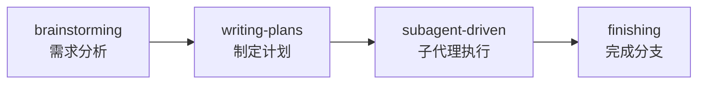
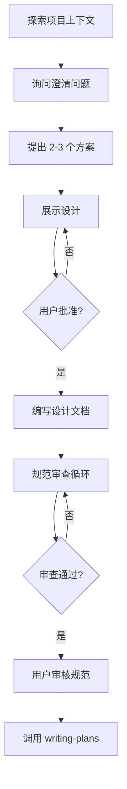
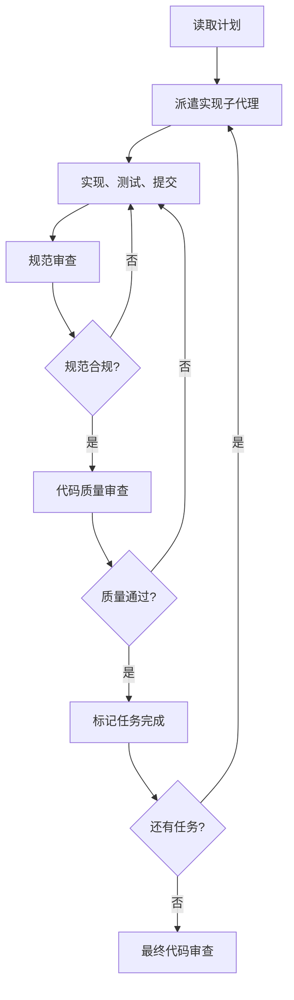
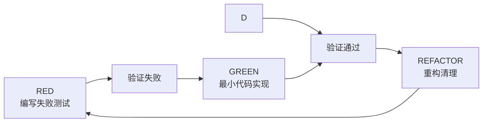

# Superpowers编程skills介绍

## 一、Superpowers介绍

::: tip 什么是 Superpowers
Superpowers 是一个完整的 AI 编程助手技能框架，基于可组合的"技能"构建，为 Claude Code、Cursor、Codex、OpenCode、Gemini CLI 等 AI 编程助手提供系统化的软件开发工作流。
:::
<!-- more -->

::: info 核心设计理念
Superpowers 的核心理念是让 AI 编程助手从"直接写代码"转变为"系统化思考后再行动"：

1. **先理解需求** - 通过对话澄清需求，而不是直接动手
2. **设计方案** - 提出多个方案供选择，获得用户确认
3. **制定计划** - 将工作分解为可管理的小任务
4. **测试驱动** - 强制执行 TDD（测试驱动开发）
5. **自动执行** - 通过子代理并行执行任务
6. **代码审查** - 自动进行规范和质量审查
:::

### 支持的平台

| 平台 | 安装方式 |
|------|----------|
| Claude Code | 插件市场安装 |
| Cursor | 插件市场安装 |
| Codex | 手动配置 |
| OpenCode | 手动配置 |
| Gemini CLI | 扩展安装 |


## 二、安装指南

### 1、Claude Code 安装

::: tabs

@tab 官方插件市场（推荐）

```shell
/plugin install superpowers@claude-plugins-official
```

@tab 第三方插件市场

```shell
# 先注册插件市场
/plugin marketplace add obra/superpowers-marketplace

# 然后安装插件
/plugin install superpowers@superpowers-marketplace
```

:::

### 2、Cursor 安装

在 Cursor Agent 聊天中安装：

```shell
/add-plugin superpowers
```

或者在插件市场中搜索 "superpowers"。

### 3、Codex 安装

告诉 Codex：

```shell
Fetch and follow instructions from https://raw.githubusercontent.com/obra/superpowers/refs/heads/main/.codex/INSTALL.md
```

详细文档：[docs/README.codex.md](https://github.com/obra/superpowers/blob/main/docs/README.codex.md)

### 4、OpenCode 安装

告诉 OpenCode：

```shell
Fetch and follow instructions from https://raw.githubusercontent.com/obra/superpowers/refs/heads/main/.opencode/INSTALL.md
```

详细文档：[docs/README.opencode.md](https://github.com/obra/superpowers/blob/main/docs/README.opencode.md)

### 5、Gemini CLI 安装

```shell
gemini extensions install https://github.com/obra/superpowers
```

更新：

```shell
gemini extensions update superpowers
```

### 6、验证安装

在你选择的平台中启动一个新会话，请求一个应该触发技能的操作（例如，"帮我规划这个功能"或"让我们调试这个问题"）。代理应该自动调用相关的 superpowers 技能。

## 三、基本工作流程

Superpowers 实现了一个完整的软件开发工作流，从需求分析到代码完成：



### 工作流程详解

| 阶段 | 技能 | 说明 |
|------|------|------|
| 1. 需求分析 | brainstorming | 通过对话澄清需求，探索方案，设计规范 |
| 2. 制定计划 | writing-plans | 将设计分解为小任务，每个任务 2-5 分钟 |
| 3. 执行任务 | subagent-driven-development | 派遣子代理执行每个任务 |
| 4. 代码审查 | requesting-code-review | 在任务之间进行代码审查 |
| 5. 完成分支 | finishing-a-development-branch | 验证测试，合并或创建 PR |

## 四、核心技能详解

### 1、brainstorming - 需求分析与设计

::: tip 使用场景
在编写任何代码之前，用于澄清需求、探索方案、设计规范。
:::

**工作流程：**



**核心原则：**
- 每次只问一个问题
- 优先使用多选题
- 遵循 YAGNI（你不需要它）
- 始终提供 2-3 个方案供选择

### 2、writing-plans - 实现计划编写

::: tip 使用场景
在获得设计批准后，用于创建详细的实现计划。
:::

**计划文件位置：** `docs/superpowers/plans/YYYY-MM-DD-<feature-name>.md`

**任务结构示例：**

````markdown
### Task 1: Hook installation script

**Files:**
- Create: `scripts/install-hook.sh`
- Modify: `config/settings.json`

- [ ] **Step 1: Write the failing test**
```bash
test_hook_installation() {
  # 测试代码
}
```

- [ ] **Step 2: Run test to verify it fails**
Expected: FAIL with "hook not found"

- [ ] **Step 3: Write minimal implementation**
```bash
#!/bin/bash
# 实现代码
```

- [ ] **Step 4: Run test to verify it passes**
Expected: PASS

- [ ] **Step 5: Commit**
```bash
git add scripts/install-hook.sh
git commit -m "feat: add hook installation script"
```
````

**核心原则：**
- 每个任务 2-5 分钟
- 精确的文件路径
- 完整的代码示例
- 明确的验证步骤

### 3、subagent-driven-development - 子代理驱动开发

::: tip 使用场景
执行实现计划，每个任务派遣一个子代理，包含两阶段审查。
:::

**工作流程：**



**优势：**
- 每个任务独立上下文，避免混淆
- 自动进行两阶段审查（规范 + 质量）
- 可以长时间自主工作
- 支持多模型选择（简单任务用便宜模型）

### 4、test-driven-development - 测试驱动开发

::: tip 使用场景
在实现任何功能或修复 bug 之前，用于确保代码质量。
:::

**红-绿-重构循环：**



**铁律：**

::: important 核心原则
没有失败的测试，就不能写生产代码。

如果在测试之前写了代码，删除它，重新开始。
:::

**常见借口与现实：**

| 借口 | 现实 |
|------|------|
| "太简单不需要测试" | 简单代码也会出错，测试只需 30 秒 |
| "我之后再写测试" | 之后写的测试立即通过，证明不了什么 |
| "我已经手动测试过了" | 手动测试是临时的，无法重复 |
| "删除 X 小时的工作太浪费" | 沉没成本谬误，保留不可信的代码才是技术债务 |

### 5、systematic-debugging - 系统化调试

::: tip 使用场景
当遇到 bug 时，用于系统化地定位和修复问题。
:::

**四阶段根因定位：**

1. **复现** - 创建最小复现案例
2. **定位** - 使用二分法定位问题
3. **理解** - 理解根本原因
4. **修复** - 修复并添加回归测试

### 6、using-git-worktrees - Git 工作树隔离

::: tip 使用场景
在开始功能开发或执行实现计划之前，用于创建隔离的工作空间。
:::

**目录选择优先级：**

1. 检查现有目录（`.worktrees` 或 `worktrees`）
2. 检查 CLAUDE.md 中的配置
3. 询问用户

**创建步骤：**

```shell
# 1. 检测项目名称
project=$(basename "$(git rev-parse --show-toplevel)")

# 2. 创建工作树
git worktree add .worktrees/feature-name -b feature/feature-name

# 3. 运行项目设置（自动检测）
npm install  # Node.js
cargo build  # Rust
pip install -r requirements.txt  # Python

# 4. 验证干净基线
npm test
```

**重要：** 创建前必须验证目录是否在 `.gitignore` 中。

### 7、finishing-a-development-branch - 分支完成流程

::: tip 使用场景
当实现完成、所有测试通过时，用于决定如何集成工作。
:::

**四个选项：**

```
Implementation complete. What would you like to do?

1. Merge back to <base-branch> locally
2. Push and create a Pull Request
3. Keep the branch as-is (I'll handle it later)
4. Discard this work

Which option?
```

### 8、requesting-code-review / receiving-code-review - 代码审查

::: tip 使用场景
在任务之间或实现完成后，用于进行代码审查。
:::

**审查清单：**
- 代码是否符合规范
- 是否有潜在 bug
- 测试覆盖是否充分
- 是否有安全漏洞

### 9、writing-skills - 创建自定义技能

::: tip 使用场景
当你需要创建新的 Superpowers 技能时使用。
:::

**技能文件结构：**

```
skills/
└── my-skill/
    ├── SKILL.md          # 技能定义
    └── references/       # 参考资料
```

**SKILL.md 示例：**

```markdown
---
name: my-skill
description: 我的自定义技能
---

# 技能名称

## 使用场景
在什么情况下使用这个技能。

## 工作流程
1. 步骤一
2. 步骤二
3. 步骤三

## 注意事项
- 注意点一
- 注意点二
```

## 五、使用示例

### 完整开发场景演示

假设我们要为项目添加用户认证功能：

#### 1. 启动需求分析

```
> 帮我为这个项目添加用户认证功能

[Superpowers 自动调用 brainstorming 技能]

让我先了解一下项目情况...
[探索项目上下文]

你的认证系统需要支持哪些功能？
1. 仅邮箱/密码登录
2. 邮箱/密码 + OAuth（Google、GitHub）
3. 邮箱/密码 + OAuth + 双因素认证

请选择：
```

#### 2. 设计确认后制定计划

```
[用户选择方案 2]

好的，我来设计认证系统...
[展示设计，获得批准]

[调用 writing-plans 技能]

计划已保存到 docs/superpowers/plans/2026-03-25-user-auth.md

两种执行方式：
1. 子代理驱动（推荐） - 每个任务派遣子代理，快速迭代
2. 内联执行 - 在当前会话中批量执行

请选择：
```

#### 3. 执行计划

```
[用户选择子代理驱动]

[调用 subagent-driven-development 技能]

Task 1: 创建用户模型
[派遣子代理执行]
[规范审查通过]
[代码质量审查通过]
✅ Task 1 完成

Task 2: 实现登录接口
[派遣子代理执行]
...
```

#### 4. 完成分支

```
所有任务完成！
测试通过：47 tests, 0 failures

[调用 finishing-a-development-branch 技能]

Implementation complete. What would you like to do?
1. Merge back to main locally
2. Push and create a Pull Request
3. Keep the branch as-is
4. Discard this work
```

## 六、注意事项

### 1、常见问题

::: tabs

@tab 技能不生效？

1. 确认插件已正确安装
2. 重启 Claude Code 或相关工具
3. 检查是否有其他插件冲突

@tab 如何更新？

```shell
# Claude Code
/plugin update superpowers

# Gemini CLI
gemini extensions update superpowers
```

@tab 如何禁用某个技能？

在项目根目录创建 `.claude/settings.json`：

```json
{
  "superpowers": {
    "disabledSkills": ["skill-name"]
  }
}
```

@tab 子代理卡住了？

1. 检查子代理是否需要更多上下文
2. 尝试使用更强大的模型
3. 如果任务太大，分解为更小的任务

:::

### 2、最佳实践

::: tip 使用建议
1. **信任流程** - 不要跳过 brainstorming 和 planning 阶段
2. **小步迭代** - 每个任务保持在 2-5 分钟
3. **坚持 TDD** - 永远先写测试
4. **定期审查** - 利用自动审查发现潜在问题
5. **使用工作树** - 保持主分支干净
:::

### 3、注意事项

::: warning 重要提醒
- Superpowers 是**强制性工作流**，不是建议
- 所有技能都会自动触发，无需手动调用
- 如果你认为某个技能"太简单不需要"，这正是最需要的时候
- 不要试图绕过 TDD 要求
:::

## 七、参考链接

- [GitHub 仓库](https://github.com/obra/superpowers)
- [官方文档](https://github.com/obra/superpowers/blob/main/README.md)
- [Discord 社区](https://discord.gg/Jd8Vphy9jq)
- [Claude Code 插件市场](https://claude.com/plugins/superpowers)
- [Claude Code 使用指南](./ClaudeCode.md)

---

::: info 总结
Superpowers 为 AI 编程助手提供了一套完整的软件开发工作流，从需求分析到代码完成，每个环节都有对应的技能支持。通过强制执行 TDD、系统化调试、自动审查等最佳实践，显著提高了 AI 辅助编程的代码质量和开发效率。

如果你正在使用 Claude Code 或其他 AI 编程助手，强烈建议尝试 Superpowers，它会让你的 AI 编程体验更上一层楼。
:::
